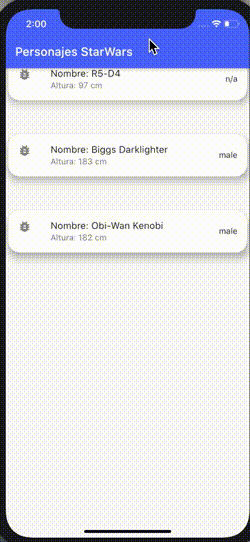
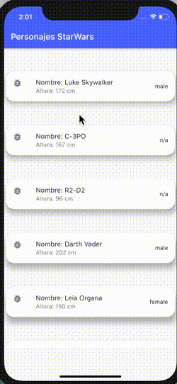
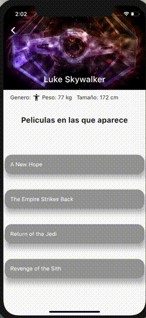

# 🤖Prueba Flutter🤖

Esta es una prueba de llamadas a Api con flutter.

## Primeros pasos

Este proyecto hace llamadas a la api de Star Wars 🤺🤺 
La api tan molona es [SWAPI](https://swapi.dev/)

En lo que consiste la app es en realizar llamadas a la api desde el la página del `Home` directamente, e ir haciendo llamadas a medida que scrolleamos hacia abajo.

Esta api da la posibilidad de hacer busquedas por Personas, Peliculas, Naves, Vehiculos, Especie, Planeta, o en el caso de esta app,
Se ha realizado busqueda por `Personas` filtrando por `Pagina`, en la cual devuelve 10 resultados en cada una.

Los diferentes personajes se muestran en `Tarjetas`, ya que me gusta la distribucion que tienen, y la sencillez de funcionamiento.

En estas tarjetas se muestra el `Nombre`, `Altura` y el `Genero`

La app actualiza la pagina `Home` al hacer scroll hacia abajo, cargando los  personajes que se encuentren en la página siguiente, y manteniendo los anteriores.

Si pulsamos en cualquiera de ellos, nos llevará a una nueva pantalla, haciendo una animación con el nombre que aparezca en la tarjeta que hemos pulsado, el cual se colocará en el appBar de la siguiente pantalla, donde se mostraran algunos detalles del personaje en que se ha pulsado.
Además de mostrarse una imagen en el fondo del appbar, en el cual también se muestra antes un .gif de carga.

Una vez estamos en al pantalla de detalles, podremos hacer scroll y "jugar" con el appbar, podiendo esconderlo.

Acemás, encontramos detalles de el personaje, así como una lista de las peliculas en las que aparece dicho personaje.

Las peliculas aparecen en una lista scrolleable de tarjetas.
Pulsando en cualquiera de ellas nos aparecerá una `AlertDialog`en el que se mostrarán los detalles de la pelicula en la que hemos pulsado.
Aparecerá un boton en dicho dialogo para poder salir de el, pero también existe la posibilidad de salir de el pulsado fuera de este.

