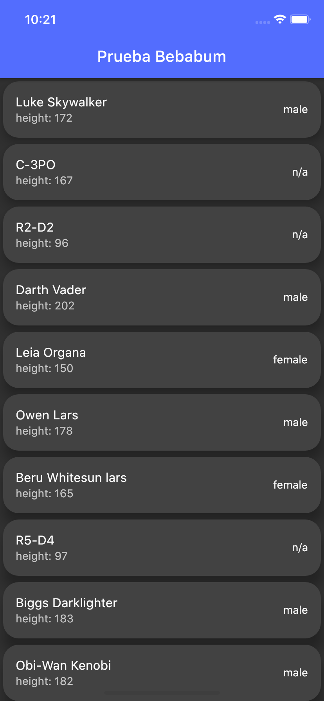

# 🤖Prueba Flutter🤖

Esta es una prueba para la empresa Bebabum, realizada en flutter.

## Primeros pasos

Este proyecto hace llamadas a la api de Star Wars 🤺🤺 
La api tan molona es [SWAPI](https://swapi.dev/)

En lo que consiste la app es en realizar llamadas a la api desde el la página del `Home` directamente.

Esta api da la posibilidad de hacer busquedas por Personas, Peliculas, Naves, Vehiculos, Especie, Planeta, o en el caso de esta app,
Se ha realizado busqueda por `Pagina`, en la cual devuelve 10 resultados en cada una.

Los diferentes personajes se muestran en `Tarjetas`, ya que me gusta la distribucion que tienen, y la sencillez de funcionamiento.

En estas tarjetas se muestra el `Nombre`, `Altura` y el `Genero`

La app actualiza la pagina `Home` al hacer scroll hacia arriba, realizando una simple animacion de carga, con un circulo girando en la parte inferior.
Una vez termina de cargar, cargan los  personajes que se encuentren en la página siguiente, eliminando los anteriores.

Si pulsamos en cualquiera de ellos, nos llevará a una nueva pantalla, donde se mostraran algunos detalles del personaje en que se ha pulsado.

Se podrían mejorar cosas como, crear una clase para los personajes, y mantenerlos todos en una lista para que se mostrasen todos en el `Home`,
Además tambien se puede estructurar mejor la página de detalles, para que tenga otro tipo de formato, incluso añadirle algunos repositorios de imagenes.

La app tiene un diseño simple y sencillo. Solo se ha añadido algún cambio de color, ya que lo que realmente me interesaba de este desarrollo era la 
funcionalidad de las llamadas a `api`.

Se ha realizado un test unitario para la comprobación de los datos, al iniciar la App.

